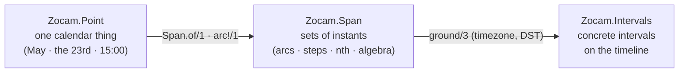

# Zocam

> **AI SLOP** — an AI agent wrote this page. [yuri4n](https://github.com/yuri4n), a senior
> engineer, gave the direction and did the review. The review is human, thus errors can stay.

Zocam is a draft Elixir library of composable time. It has two layers:

- `Zocam.Intervals` is the linear kernel: an algebra of intervals on the real timeline (union, intersection, complement, diff).
- The temporal-things model is the calendar layer. `Zocam.Point` builds calendar values such as "May", "the 23rd", or "a Wednesday at 15:00". `Zocam.Span` builds sets of instants over points: arcs, unions, intersections, complements, steps, and ordinals. `Span.ground/3` maps a set to concrete intervals in a timezone.

*Figure 1 — The two layers and the one crossing point: a span meets the real timeline only in `ground/3`. AI generated, human reviewed.*

The calendar layer answers two questions with ONE denotation function, so
they can never disagree:

- `Span.member?(span, datetime)` — is this instant in the set?
- `Span.ground(span, horizon, timezone)` — which concrete intervals does
  the set cover inside this horizon? On a DST fall-back day one wall
  window grounds to two intervals; a wall time inside a spring-forward
  gap grounds to none.

## Status

Zocam is implemented: every public function has a body, and the test suite is fully green with no backlog. The API can still change — the library is young. The code grows test-first (TDD): the tests state the semantics, and the code follows them.

The `s7r` app in the parent directory consumes this library as a path dependency: `{:zocam, path: "zocam"}`.

## Use

- Run the tests: `mix test`
- Build the documentation: `mix docs`

## Design records

The ADRs in `docs/` record the design choices:

- [ADR-001](docs/adr-001-refinement-chain.md) — the refinement-chain model for calendar points.
- [ADR-002](docs/adr-002-set-primary-spans.md) — sets first: the Span algebra.
- [ADR-003](docs/adr-003-overflow-policy.md) — overflow policy: clamp by default, skip on request.
- [ADR-004](docs/adr-004-fortnight-scopes.md) — fortnights as every-k scopes.
- [ADR-005](docs/adr-005-shared-denotation.md) — one shared denotation function, and DST.
- [ADR-006](docs/adr-006-library-extraction.md) — the time layer as the zocam library.
