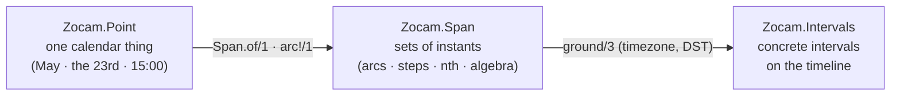

# Zocam

> **AI SLOP** — an AI agent wrote this page. [yuri4n](https://github.com/yuri4n), a senior
> engineer, gave the direction and did the review. The review is human, thus errors can stay.

Zocam is an Elixir library of composable time. It has two layers:

- `Zocam.Intervals` is the linear kernel: an algebra of intervals on the real timeline (union, intersection, complement, diff).
- The temporal-things model is the calendar layer. `Zocam.Point` builds calendar values such as "May", "the 23rd", or "a Wednesday at 15:00". `Zocam.Span` builds sets of instants over points: arcs, unions, intersections, complements, steps, and ordinals. `Span.ground/3` maps a set to concrete intervals in a timezone.



*Figure 1 — The two layers and the one crossing point: a span meets the real timeline only in `ground/3`. AI generated, human reviewed.*

The calendar layer answers two questions with ONE denotation function, so
they can never disagree:

- `Span.member?(span, datetime)` — is this instant in the set?
- `Span.ground(span, horizon, timezone)` — which concrete intervals does
  the set cover inside this horizon? On a DST fall-back day one wall
  window grounds to two intervals; a wall time inside a spring-forward
  gap grounds to none.

## Install

Zocam is on [Hex](https://hex.pm/packages/zocam). Add it to your `mix.exs`:

```elixir
{:zocam, "~> 0.1"}
```

The API reference is on [hexdocs.pm/zocam](https://hexdocs.pm/zocam).

## Status

Zocam is implemented: every public function has a body, and the test suite is fully green with no backlog. The API can still change — the library is young. The code grows test-first (TDD): the tests state the semantics, and the code follows them.

## Use

- Run the tests: `mix test`
- Build the documentation: `mix docs`
- Release: push a tag `vX.Y.Z` that equals the `version` in `mix.exs`. GitHub Actions runs the tests and publishes the package to Hex.pm and the docs to hexdocs.pm.

## Design records

Each design choice has a record. The records are pages on the documentation
site, not files in this repository: [zocam.dev/design](https://zocam.dev/design).

They are not part of the API reference on hexdocs, because each record is a
website page with its own diagrams and frontmatter, which ExDoc would print as
raw text. This reference documents the code; the site documents the decisions
behind it.
