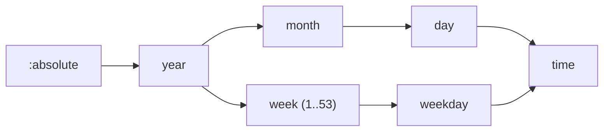

# ADR-001: The refinement-chain model for calendar points

> **AI SLOP** — an AI agent wrote this page. [yuri4n](https://github.com/yuri4n), a senior
> engineer, gave the direction and did the review. The review is human, thus errors can stay.

## Status

Accepted, 2026-08-04, decided by the project owner.

## Context

S7r must represent partial calendar values: "May", "15:00", "the 23rd", "May 2026", "a Wednesday". These values are all "things about time", but they differ in two ways. Some repeat ("May" returns each year) and some do not ("May 2026"). Some name a month, some a day, some a clock time.

We want one data type for all of them. The type must support two operations. First, composition: "May" plus "the 23rd" gives "May 23rd". Second, grounding: a value must map to real intervals on the timeline. The type must also reject nonsense, such as "May of June", as early as possible.

## Options

### Option 1: field-mask model

One struct with an optional field per unit: `year`, `month`, `day`, `time`. A `nil` field means "not bound".

Caveat: the struct cannot say *which* units are bound without ad-hoc rules. Is `%{month: :may, time: nil}` a month or a set of instants? Worse, weeks do not nest in months, so a `week` field and a `month` field would conflict in the same struct. This is the anemic-record anti-pattern: the data holds values, but the meaning lives in scattered checks.

### Option 2: combinator model

A free-form expression tree of combinators, like a parser combinator library. This is the interpreter pattern applied too early.

Caveat: many meaningless expressions type-check. "May of June" builds a valid tree. Every consumer must then validate at runtime, so validation spreads through the whole codebase instead of living in one place.

### Option 3: refinement-chain model (chosen)

A point is a pair `{scope, chain}`. The scope is the cycle in which the point repeats: `:absolute`, `:year`, `:month`, `:week`, or `:day`. The chain is a list of contiguous valued segments. It starts directly under the scope and descends the unit graph, one unit at a time, to a grain.

## Decision

We chose the refinement-chain model. `Zocam.Point` implements it. The precise rules:

- Concrete and abstract are not two types. A point is concrete exactly when `scope == :absolute`. "May" is `{scope: :year, chain: [month: :may]}`; "May 2026" is `{scope: :absolute, chain: [year: 2026, month: :may]}`.
- Chains must follow the edges of the unit graph. The week branch is a sibling of the month branch, because weeks do not nest in months.

*Figure 1 — The unit graph: the edges a chain can follow from a scope down to a grain. AI generated, human reviewed.*

- `compose/2` concatenates two chains. It is defined only when the inner scope **class** equals the outer grain **class**. Classes matter: `weekday` and `day` are different units with the same class, `:day`. A raw atom comparison would make "a Wednesday at 15:00" unreachable.
- Composition is arrow composition in a category. In simple terms: units are the objects, points are the arrows, and two arrows compose only where they meet.
- When the guard fails, the meaning is usually a *set*, not a point. "15:00 of May" leaves the day free. For these sets, use `Zocam.Span.intersection/1`. The `ComposeError` hint names this function.
- Fortnight-like rhythms live in the scope as `{:every, k, cycle, anchor}`. See [ADR-004](adr-004-fortnight-scopes.md).

## Consequences

Easy now:

- One validation walk in `Point.new!/1` checks every chain. All other functions trust it.
- Composition is total where it is defined, and each failure has a typed reason and a repair hint.
- The set layer stays separate: `Zocam.Span` lifts points and handles everything a chain cannot say.

Hard now:

- Two type axes (scope class, grain class) take time to learn. The readers `grain_class/1` and `scope_class/1` expose them.
- The unit graph is fixed. A new unit (for example, quarters) needs a new edge and a new class decision.

Open items:

- `Span.of/1` and the set operators are implemented. The core property (`member?/2` agrees with `ground/3`) must stay guarded by tests.
