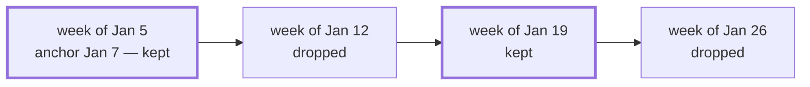

# ADR-004: Fortnights as every-k scopes

> **AI SLOP** — an AI agent wrote this page. [yuri4n](https://github.com/yuri4n), a senior
> engineer, gave the direction and did the review. The review is human, thus errors can stay.

## Status

Accepted, 2026-08-04, decided by the project owner.

## Context

Real schedules use rhythms that are coarser than one cycle. "Every second week" is a fortnight. "Every third month" is a quarter rota. The base cycles (`:year`, `:month`, `:week`, `:day`) repeat on every instance, so they cannot express these rhythms.

A rhythm also needs a phase. Two teams can both meet "every other Wednesday" and never meet in the same week. The model must record which weeks a point keeps.

Payroll and rota cases need fortnights immediately. This feature is part of v1, not an extension.

## Options

1. **A dedicated `:fortnight` cycle unit.** Caveat: it does not generalize. "Every third week" and "every second month" would each need a new unit. Each unit would also need its own calendar arithmetic. This is an ad-hoc design.
2. **A step inside arcs.** An arc step samples cells *inside one instance* (see [ADR-002](adr-002-set-primary-spans.md)). Caveat: a step cannot thin the *stream of instances* itself. The rhythm lives one level higher than the step, so this is the wrong layer.
3. **A scope wrapper `{:every, k, cycle, anchor}`.** This is the decorator pattern: the wrapper changes the rhythm of a base cycle and keeps everything else. Caveat: the anchor adds one identity-like field, and the API must protect it.

## Decision

We chose option 3, with **subsequence semantics**. The scope `{:every, k, cycle, anchor}` keeps every k-th instance of the base cycle, counted from the instance that contains the anchor date. Each kept instance keeps the size of the base cycle: a fortnight point still denotes week-sized things, not 14-day things.

*Figure 1 — Subsequence semantics: a fortnight keeps every second week, counted from the anchor. AI generated, human reviewed.*

The precise rules:

- `Point.every/3` builds these scopes. It accepts only points with a plain cycle scope.
- An `:absolute` point is rejected: it happens once, so it cannot repeat.
- Re-anchoring an existing `{:every, ...}` point is rejected. An anchor is identity, not a parameter to mutate. Nested anchors would hide which phase wins, so you restate the rhythm from the base cycle.
- `compose/2` keeps an every-scoped **outer** point: the phase lives in the scope, and compose keeps the outer scope. An every-scoped **inner** point fails with reason `:anchored`, because a chain has no place for the phase.

> The class of `{:every, k, cycle, _}` is the class of its base cycle. `k` changes the rhythm of the instances, not their size. This one rule keeps all composition arithmetic unchanged.

## Consequences

**Easy:**

- Any rhythm over any cycle works: every 2nd week, every 3rd month, every 10th day. One wrapper covers them all.
- No new calendar arithmetic. The class mapping folds the wrapper away, so `compose/2` and the validators do not change.
- "Every other Wednesday at 15:00" composes as normal points, then takes the rhythm once with `every/3`.

**Hard:**

- The phase check is not in `Point`. `Zocam.Span.of/1` and `ground/3` must count instances from the anchor. A backlog test pins this: the fortnightly Wednesday alternates from Jan 7, 2026.
- Users must restate a rhythm to change it. This is a small cost, chosen on purpose.

**Open items:**

- Implement the phase arithmetic in the `Span` interpreters (`member?/2` and `ground/3` must agree).
- Decide how `stream/3` finds the first kept instance after an arbitrary start instant.
