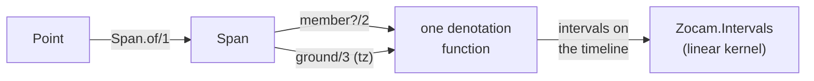

# ADR-005: One denotation function, and what DST does to it

> **AI SLOP** — an AI agent wrote this page. [yuri4n](https://github.com/yuri4n), a senior
> engineer, gave the direction and did the review. The review is human, thus errors can stay.

## Status

Accepted, 2026-08-04, decided by the project owner.

## Context

Two operations answer the same question: "what does this point mean on the real timeline?"

- `Span.member?/2` asks it for one instant. It is symbolic: no horizon, no enumeration.
- `Span.ground/3` asks it for a whole horizon. It enumerates into the linear kernel.

If the two are two implementations, their answers can drift. This was a real defect class, caught in review: "the 31st" in February. Under `:clamp` the point fires on Feb 28 (see [ADR-003](adr-003-overflow-policy.md)). One implementation clamped; the other did not. The same instant got two different answers from one span.

The force behind the drift is duplication. Clamping, ordinal skipping, and closings are subtle rules. Two copies of a subtle rule always separate over time.

## Options

**Option A: two independent implementations.** Each query optimizes its own path. Caveat: this is the drift we already hit. Nothing forces the copies to agree.

**Option B: define `member?` as a call to `ground` over a one-instant horizon.** Correct by construction. Caveat: it turns a symbolic question into an enumeration. `nth` grounding widens to whole cycle instances first, so even a one-instant probe can enumerate a full month. The cost model becomes wrong for the common query.

**Option C: a shared kernel.** One clamp-aware denotation function holds all the rules. `member?/2` and `ground/3` are thin interpreters over it. The pattern is a *single source of truth*: two query interfaces, one shared kernel. This extends the interpreter pattern from [ADR-002](adr-002-set-primary-spans.md): the span tree is the free algebra, and both interpreters now share their semantics.

## Decision

We chose option C. There is one denotation function. `member?/2` and `ground/3` both call it. Clamping, ordinal skipping, and closings behave identically in both.

*Figure 1 — Both queries pass through one denotation function into the linear kernel. AI generated, human reviewed.*

A property test pins the law, so the sharing cannot silently break:

> `member?(span, t)` is true exactly when `t` falls inside some interval of `ground(span, horizon, tz)`, for every `t` in the horizon.

The precise DST rules:

- **Grounding happens only in `Span.ground/3`.** `Point` stays timezone-free and pure. The calendar meets the real timeline in one place.
- **Fall-back:** the wall clock repeats an hour, so the preimage of a wall window is discontiguous. One instance grounds to one *or more* kernel intervals. The pieces are never joined: in `America/New_York` on 2026-11-01, wall `00:30..01:30` grounds to `04:30Z..05:30Z` *and* `06:00Z..06:30Z`.
- **Spring-forward:** the wall time does not exist. The instance is skipped; it grounds to nothing. Wall `02:30` on 2026-03-08 yields an empty result.

The 2026 fixtures in `test/zocam/span_test.exs` pin these real dates. All calendar facts in them are machine-verified.

## Consequences

**Easy now:**

- You add a new denotation feature (a policy, an ordinal rule, a closing) once. Both queries then agree by construction.
- The "31st in February" defect class needs review at one site, not two.
- The law is a cheap regression check: any probe instant can test it.

**Hard now:**

- `member?/2` cannot take a shortcut that the shared function does not offer. Every optimization must keep the law.
- The two queries answer at different levels: `member?/2` reads the wall clock of the given `DateTime`, and `ground/3` maps wall time to the timeline. The law still holds through DST. A gap instant has no `DateTime` in that zone, and both fall-back instants map to wall times inside the window.

**Open items:** the law holds in the current test suite; a generated property test is still a good next step. `stream/3` must keep using the same denotation.
