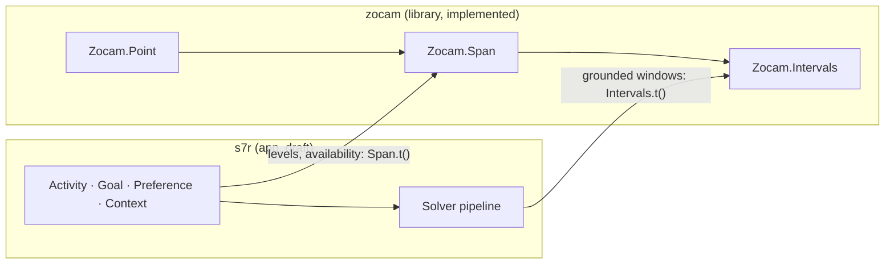

# ADR-006: The time layer as the zocam library

> **AI SLOP** — an AI agent wrote this page. [yuri4n](https://github.com/yuri4n), a senior
> engineer, gave the direction and did the review. The review is human, thus errors can stay.

## Status

Accepted, 2026-08-04, decided by the project owner ("separate it as a library"). The name, the project shape, and the module split are implementation choices by Claude, reviewed with the rest of this change.

## Context

The time layer became complete and self-contained: `Intervals` (the linear kernel), `Point` (calendar things), and `Span` (sets of instants) are fully implemented and tested, while the scheduling app around them is still a typed draft. The app consumes the layer only through types and a few calls. Nothing in the layer knows about activities, goals, or solvers. Code with that profile is a library.

## Options

### Option 1: keep one mix project

No structural change. Caveat: the boundary stays informal. App code can reach into kernel internals, and the time layer cannot be reused or versioned alone.

### Option 2: an umbrella project

Restructure the repository into `apps/s7r` and `apps/zocam`. Caveat: umbrellas force shared configuration and a heavier layout onto a project with exactly two parts, one of which is a draft.

### Option 3: a path dependency (chosen)

A standalone mix project in `zocam/`, consumed by the app as `{:zocam, path: "zocam"}`. The boundary is a real OTP application with its own tests and docs, but the code stays in one repository and one review flow. Publishing to Hex later is a version bump, not a restructure.

## Decision

- The library is **zocam**: modules `Zocam.Intervals`, `Zocam.Point`, `Zocam.Span`, plus the `Zocam` overview module.
- **`Intervals` moves too.** `Span.ground/3` produces kernel intervals and `Arc` reuses the kernel's closing type. Splitting the tower would force a shared third package or duplicate types; one library carries all three layers.
- **The kernel became calendar-free.** `Intervals.timables/0` narrowed to `Time.t() | DateTime.t()`. Weekday and month atoms could never be ordered by the comparison helpers, so they were data no operation could touch; the calendar vocabulary now lives in `Zocam.Point`, and `Zocam.Span.ground/3` is the path from "a Saturday" to concrete intervals.
- **These ADR sources live in `zocam/docs/`** and ship as ExDoc extras. The documentation site ingests them, so there is one source of truth per decision record.

*Figure 1 — The dependency direction after the split: the app points into the library, never back. AI generated, human reviewed.*

## Consequences

- Two test suites: `mix test` in the repository root (app) and in `zocam/` (library). Both must stay green.
- The app's abstract time fields (`Preference.levels`, `Context.availability`) hold `Zocam.Span.t()` values. Concrete placements (occurrences, events, solver windows) stay `Zocam.Intervals` values: the solver only ever sees grounded time.
- `zocam` runs no processes and holds no state. If a consumer needs caching (for example, memoized grounding), that consumer builds its own process layer on top of these pure functions.
