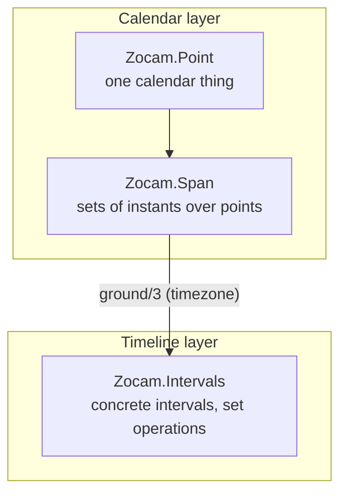

[AI SLOP]{.ai-slop} An AI agent wrote this page. [yuri4n](https://github.com/yuri4n), a senior engineer, gave the direction and did the review. The review is human, thus errors can stay.

## What zocam is

Zocam is a time library for Elixir. It does not schedule, store, or format anything. It answers one kind of question well: *which instants does this calendar expression denote?*

The word *algebra* describes the style. The library is built from small, composable values and pure functions over them. You combine them like expressions, not like configuration.

The name is a calendar word from the land the author is from: *zocam* is the Muisca common year, a cycle of twenty moons. Colonial priest José Domingo Duquesne recorded it in Bogotá; Humboldt studied it later. The word never stood alone — the Muisca said "zocam ata", year one — which suits a library whose values are always composed.

## The two layers

*Figure 1 — The calendar layer builds symbolic sets; the timeline layer holds concrete intervals; `ground/3` is the only crossing. AI generated, human reviewed.*

**`Zocam.Intervals`** is the linear kernel: an algebra of intervals on the real timeline, with union, intersection, complement, and difference. Every higher layer reduces its questions to interval operations, so one small algebra serves the whole system.

**`Zocam.Point`** models one calendar thing as a scope plus a refinement chain. "May 2026" is concrete; "May" is abstract — it names every May. The chain refines step by step: year, month, day, hour ([ADR-001](/design/adr-001-refinement-chain)).

**`Zocam.Span`** models *sets* of instants built from points: arcs with steps, unions, intersections, complements, and ordinal picks such as "the last working day of the month" ([ADR-002](/design/adr-002-set-primary-spans)).

## One denotation function

The calendar layer answers two questions with one shared denotation function, so they can never disagree ([ADR-005](/design/adr-005-shared-denotation)):

- `Span.member?(span, datetime)` — is this instant in the set?
- `Span.ground(span, horizon, timezone)` — which concrete intervals does the set cover inside this horizon?

Timezones make this subtle. On a DST fall-back day, one wall-clock window grounds to two intervals. A wall time inside a spring-forward gap grounds to none. The shared denotation pins both behaviors in one place.

## Status

Zocam is implemented: every public function has a body, and the test suite is fully green with no backlog. The API can still change — the library is young, and it keeps the freedom to break for a better design. The code grows test-first (TDD): the tests state the semantics, and the code follows them.
