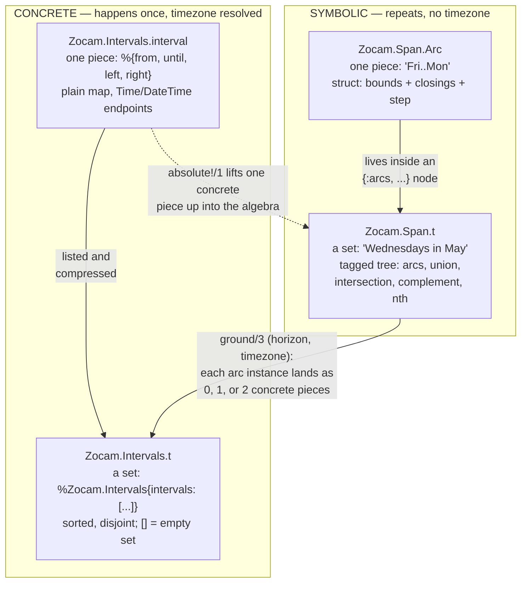

[AI SLOP]{.ai-slop} An AI agent wrote this page. [yuri4n](https://github.com/yuri4n), a senior engineer, gave the direction and did the review. The review is human, thus errors can stay.

## Two questions place every type

Four types carry all data in zocam. When you meet one, ask two questions:

1. Does this value hold **one piece** of time, or a **set** of pieces?
2. Is it **symbolic** — a calendar shape that repeats, with no timezone — or **concrete** — a window on the real timeline, timezone already resolved?

The answers form a two-by-two map:

|                            | one piece            | a set of pieces    |
| -------------------------- | -------------------- | ------------------ |
| **symbolic** (repeats)     | `Zocam.Span.Arc`     | `Zocam.Span.t`     |
| **concrete** (happens once) | `Zocam.Intervals.interval` | `Zocam.Intervals.t` |



_Figure 1 — The four names on one map: piece or set (columns), symbolic or concrete (rows). `ground/3` is the only way down; `absolute!/1` is the only way up. AI generated, human reviewed._

## The four names, one by one

### `Zocam.Span.Arc` — one symbolic piece

A struct with two bounds (point chains), a closing per side, an optional step, and an overflow policy. It **repeats**: `Fri..Mon` happens once in every week. An arc never travels alone — it always sits inside an `{:arcs, scope, grain, arcs}` node of a span, and the node owns the scope and the grain:

```elixir
{:arcs, :week, :day, [arc]} =
  Zocam.Span.arc!(
    from: Zocam.Point.weekday(:friday),
    until: Zocam.Point.weekday(:monday)
  )

arc.from   #=> [weekday: :friday]
arc.until  #=> [weekday: :monday]
```

### `Zocam.Span.t` — a symbolic set

A span is **not a struct**. It is a recursive tagged tuple — the expression tree of a set algebra. Even a single point lifts to a one-arc *set*:

```elixir
Zocam.Span.of(Zocam.Point.month(:may))
#=> {:arcs, :year, :month, [%Zocam.Span.Arc{from: [month: :may], ...}]}
```

Why is the set primary? **Closure.** The complement of one arc is already two pieces, and a difference can cut one piece into two. A lone piece cannot be closed under its own operators, so every operator answers with a set ([ADR-002](/design/adr-002-set-primary-spans)).

### `Zocam.Intervals.interval` — one concrete piece

A plain map with exactly four keys. The endpoints are `Time` or `DateTime` values; `nil` means "unbounded on this side" (a ray). Nothing repeats: this window happens once. The `horizon` argument of `ground/3` is exactly one such interval:

```elixir
horizon = %{
  from: ~U[2026-05-01 00:00:00Z],
  until: ~U[2026-06-01 00:00:00Z],
  left: :closed,
  right: :open
}
```

### `Zocam.Intervals.t` — a concrete set

The `%Zocam.Intervals{}` struct wraps one list of intervals, kept sorted and disjoint by `compress/1`. An empty list inside is the empty set. `ground/3` is the bridge from the symbolic column to the concrete one:

```elixir
weds = Zocam.Span.of(Zocam.Point.weekday(:wednesday))
may  = Zocam.Span.of(Zocam.Point.month(:may))
span = Zocam.Span.intersection([weds, may])

Zocam.Span.ground(span, horizon, "Etc/UTC")
#=> %Zocam.Intervals{intervals: [
#=>   %{from: ~U[2026-05-06 00:00:00Z], until: ~U[2026-05-07 00:00:00Z],
#=>     left: :closed, right: :open},
#=>   ...three more Wednesdays...
#=> ]}
```

On a DST fall-back day one arc instance lands as **two** concrete pieces, and inside a spring-forward gap it lands as **none** — that is why the count is "0, 1, or 2", never always 1.

## One caution: the kernel answers in the shape you ask

`Zocam.Intervals` accepts all three spellings of "some intervals" — one bare map, a plain list, or the struct — and the answer follows the shape of the first argument. Piece-level calls give piece-level answers, so "nothing remains" is `nil`, not an empty set:

```elixir
block = %{from: ~T[09:00:00], until: ~T[17:00:00], left: :closed, right: :open}

Zocam.Intervals.diff(block, block)                              #=> nil
Zocam.Intervals.diff([block], [block])                          #=> []
Zocam.Intervals.diff(%Zocam.Intervals{intervals: [block]}, [block])
#=> %Zocam.Intervals{intervals: []}
```

The same table lives in the API reference, in the `Zocam` module documentation, where each example runs as a doctest — the test suite proves that this page's claims stay true.
