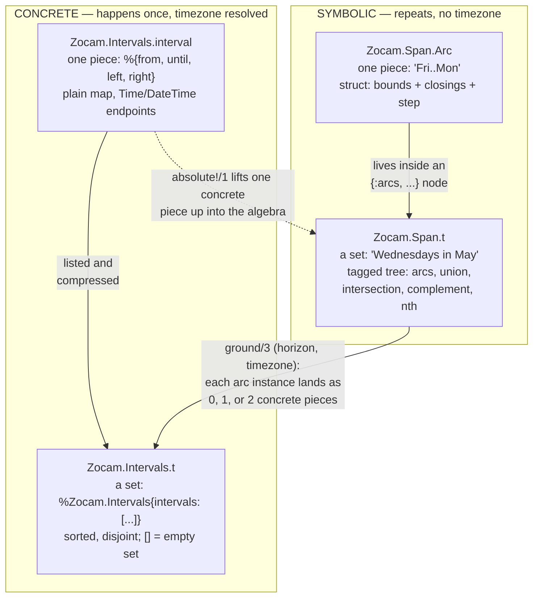

[AI SLOP]{.ai-slop} An AI agent wrote this page. [yuri4n](https://github.com/yuri4n), a senior engineer, gave the direction and did the review. The review is human, thus errors can stay.

## Two questions place every type

This page gives you the map of the data. When you know which type you hold, you know which operations apply, what shape their answer has, and what `Enum` hands you when you walk the value. The end of this page states the two rules that carry all of that.

Four types carry all data in zocam. When you meet one, ask two questions:

1. Does this value hold **one piece** of time, or a **set** of pieces?
2. Is it **symbolic** — a calendar shape that repeats, with no timezone — or **concrete** — a window on the real timeline, timezone already resolved?

The answers form a two-by-two map:

|                            | one piece            | a set of pieces    |
| -------------------------- | -------------------- | ------------------ |
| **symbolic** (repeats)     | `Zocam.Span.Arc`     | `Zocam.Span.t`     |
| **concrete** (happens once) | `Zocam.Intervals.interval` | `Zocam.Intervals.t` |

_Figure 1 — The two questions and the four names they place. AI generated, human reviewed._

A `Zocam.Point` sits below this map: a point names one calendar thing, and `Zocam.Span.of/1` lifts it onto the map as a one-arc set.



_Figure 2 — The four names on one map: piece or set (columns), symbolic or concrete (rows). `ground/3` is the only way down; `absolute!/1` is the only way up. AI generated, human reviewed._

## The four names, one by one

### `Zocam.Span.Arc` — one symbolic piece

A struct with two bounds (point chains), a closing per side, an optional step, and an overflow policy. It **repeats**: `Fri..Mon` happens once in every week. An arc never travels alone — it always sits inside an `{:arcs, scope, grain, arcs}` node of a span, and the node owns the scope and the grain:

```elixir
{:arcs, :week, :day, [arc]} =
  Zocam.Span.arc!(
    from: Zocam.Point.weekday(:friday),
    until: Zocam.Point.weekday(:monday)
  )

arc.from   #=> [weekday: :friday]
arc.until  #=> [weekday: :monday]
```

### `Zocam.Span.t` — a symbolic set

A span is **not a struct**. It is a recursive tagged tuple — the expression tree of a set algebra. Even a single point lifts to a one-arc *set*:

```elixir
Zocam.Span.of(Zocam.Point.month(:may))
#=> {:arcs, :year, :month, [%Zocam.Span.Arc{from: [month: :may], ...}]}
```

Why is the set primary? **Closure.** The complement of one arc is already two pieces, and a difference can cut one piece into two. A lone piece cannot be closed under its own operators, so every operator answers with a set ([ADR-002](/design/adrs/002-set-primary-spans)).

### `Zocam.Intervals.interval` — one concrete piece

A plain map with exactly four keys. The endpoints are `Time` or `DateTime` values; `nil` means "unbounded on this side" (a ray). Nothing repeats: this window happens once. The `horizon` argument of `ground/3` is exactly one such interval:

```elixir
horizon = %{
  from: ~U[2026-05-01 00:00:00Z],
  until: ~U[2026-06-01 00:00:00Z],
  left: :closed,
  right: :open
}
```

### `Zocam.Intervals.t` — a concrete set

The `%Zocam.Intervals{}` struct wraps one list of intervals, kept sorted and disjoint by `compress/1`. An empty list inside is the empty set. `ground/3` is the bridge from the symbolic column to the concrete one:

```elixir
weds = Zocam.Span.of(Zocam.Point.weekday(:wednesday))
may  = Zocam.Span.of(Zocam.Point.month(:may))
span = Zocam.Span.intersection([weds, may])

Zocam.Span.ground(span, horizon, "Etc/UTC")
#=> %Zocam.Intervals{intervals: [
#=>   %{from: ~U[2026-05-06 00:00:00Z], until: ~U[2026-05-07 00:00:00Z],
#=>     left: :closed, right: :open},
#=>   ...three more Wednesdays...
#=> ]}
```

On a DST fall-back day one arc instance lands as **two** concrete pieces, and inside a spring-forward gap it lands as **none** — that is why the count is "0, 1, or 2", never always 1.

## A recipe: from a sentence to concrete windows

You want the Wednesdays of May 2026 as UTC windows. Do these steps. Step 1 builds points — the raw material below the map. Each step after it lands in one cell of the map above:

**Step 1 — name the pieces of the sentence as points.** "May" and "a Wednesday" are each one calendar thing:

```elixir
may_point = Zocam.Point.month(:may)         # repeats each year
wed_point = Zocam.Point.weekday(:wednesday) # repeats each week
```

**Step 2 — lift each point into the set algebra.** `Span.of/1` turns a point into a one-arc *symbolic set* (`Zocam.Span.t`, top-right cell):

```elixir
may  = Zocam.Span.of(may_point)
weds = Zocam.Span.of(wed_point)
```

**Step 3 — intersect.** The two sets live in different cycles (year and week), so the result has no finite form yet. It stays symbolic, as data:

```elixir
span = Zocam.Span.intersection([weds, may])
```

**Step 4 — choose a horizon.** The horizon is *one concrete piece* (`Zocam.Intervals.interval`, bottom-left cell): the window of the real timeline you care about.

```elixir
horizon = %{
  from: ~U[2026-05-01 00:00:00Z],
  until: ~U[2026-06-01 00:00:00Z],
  left: :closed,
  right: :open
}
```

**Step 5 — ground.** `ground/3` crosses from the symbolic row to the concrete row. The answer is a *concrete set* (`Zocam.Intervals.t`, bottom-right cell) — May 2026 has four Wednesdays:

```elixir
Zocam.Span.ground(span, horizon, "Etc/UTC")
#=> %Zocam.Intervals{intervals: [
#=>   %{from: ~U[2026-05-06 00:00:00Z], until: ~U[2026-05-07 00:00:00Z],
#=>     left: :closed, right: :open},
#=>   ...May 13, May 20, May 27...
#=> ]}
```

The `Zocam.Span` reference opens with more recipes ("every second Friday, 09:00–12:00", "the last working day of the month"), and every example there runs as a doctest.

## One rule for shapes: an operation on sets answers with a set

`Zocam.Intervals` accepts all three spellings of "some intervals" — one bare map, a plain list, or the struct. The answer does not follow the input. An operation on sets (`union/2`, `intersect/2`, `diff/2`, `complement/1`, `compress/1`) always answers with the set struct, whatever shape the operands came in. A constructor of a piece answers with a piece: `new!/1` builds one interval map. A question answers with a boolean: `overlaps?/2`.

Why one shape? So that "nothing remains" has exactly one spelling. When the answer followed the input, a piece-level call answered `nil` and a list-level call answered `[]`, and every caller had to guard for both. Now the empty set is the only "nothing":

```elixir
block = Zocam.Intervals.new!(from: ~T[09:00:00], until: ~T[17:00:00])
block  # a piece constructor answers with a piece: one plain map
#=> %{from: ~T[09:00:00], until: ~T[17:00:00], left: :closed, right: :open}

Zocam.Intervals.diff(block, block)      #=> %Zocam.Intervals{intervals: []}
Zocam.Intervals.diff([block], [block])  #=> %Zocam.Intervals{intervals: []}
```

The symbolic row already obeyed this rule: every `Zocam.Span` operator answers with a span, even over one arc ([ADR-002](/design/adrs/002-set-primary-spans)). Both layers now say one sentence: *an operation on sets answers with a set; a constructor of a piece answers with a piece.*

## Three ways to walk: what `Enum` means here

A set is one value that holds pieces, so the next question is natural: what do you get when you walk it? The answer depends on where the value sits on the map.

| you walk                         | you get                                                         |
| -------------------------------- | --------------------------------------------------------------- |
| `%Zocam.Intervals{}` with `Enum` | its concrete pieces, in order                                   |
| a `Zocam.Span.Arc` with `Enum`   | the symbolic cells of one instance                              |
| `Zocam.Span.stream/3`            | concrete occurrences over real time, lazily, from an instant on |

_Figure 3 — The three walks: concrete pieces out of a set, symbolic cells out of an arc, and a lazy stream of real occurrences out of a span. AI generated, human reviewed._

**A concrete set yields concrete pieces.** The struct implements `Enumerable`, so `Enum` walks its intervals in normal-form order. Ground a span, then read one field off every piece:

```elixir
weds = Zocam.Span.of(Zocam.Point.weekday(:wednesday))
horizon = %{from: ~U[2026-01-05 00:00:00Z], until: ~U[2026-01-19 00:00:00Z],
            left: :closed, right: :open}

Zocam.Span.ground(weds, horizon, "Etc/UTC") |> Enum.map(& &1.from)
#=> [~U[2026-01-07 00:00:00Z], ~U[2026-01-14 00:00:00Z]]
```

One trap here: `Enum.member?/2` asks "is this value one of the pieces?", not "is this instant covered by the set?". For coverage, keep the span and ask `Zocam.Span.member?/2`.

**An arc yields the symbolic cells of one instance.** An arc repeats, so `Enum` cannot walk all of it. It walks one instance, cell by cell, and stays symbolic — no timezone, no dates:

```elixir
{:arcs, _, _, [weekend]} =
  Zocam.Span.arc!(
    from: Zocam.Point.weekday(:friday),
    until: Zocam.Point.weekday(:monday)
  )

Enum.to_list(weekend)  #=> [:friday, :saturday, :sunday, :monday]
```

Closings are honored: an `:open` side drops that bound's cell. A wrap walks through the cycle seam: `Nov..Feb` is four month cells. A step samples every n-th cell, so a stepped `:time` arc yields its sampled `Time` values. The pitfall is the `:time` arc *without* a step: it is continuous — between any two instants sit infinitely many more — so `Enum` on it raises and names the two ways out: give the arc a step, or ground the span and walk the concrete intervals.

**A stream yields concrete occurrences over real time.** `Enum` over an arc shows you the shape of one instance. When you want the instances themselves — real windows, one after the other, with no right bound to pick first — ask `Zocam.Span.stream/3`. It grounds chunk by chunk and stays lazy, so take what you need:

```elixir
weds = Zocam.Span.of(Zocam.Point.weekday(:wednesday))

Zocam.Span.stream(weds, ~U[2026-01-01 00:00:00Z], "Etc/UTC") |> Enum.take(2)
#=> [%{from: ~U[2026-01-07 00:00:00Z], until: ~U[2026-01-08 00:00:00Z],
#=>    left: :closed, right: :open},
#=>  %{from: ~U[2026-01-14 00:00:00Z], until: ~U[2026-01-15 00:00:00Z],
#=>    left: :closed, right: :open}]
```

The same rules live in the API reference — in the `Zocam`, `Zocam.Intervals`, and `Zocam.Span.Arc` module docs — and each example there runs as a doctest, so the test suite proves that this page's claims stay true.
