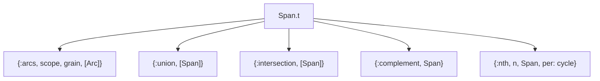

[AI SLOP]{.ai-slop} an AI agent wrote this page. [yuri4n](https://github.com/yuri4n), a senior engineer, gave the direction and did the review. The review is human, thus errors can stay.

## Status

Accepted, 2026-08-04, decided by the project owner.

## Context

A single calendar point cannot express common schedules. "15:00 of every day of May" needs an intersection. "Mondays and Wednesdays" needs a union. "Every 15 minutes from 09:00 to 17:00" needs an interval with a step.

The library needs two things at once: bounded ranges over calendar points (arcs), and a set algebra over them (union, intersection, complement, diff). The force in tension is closure. The complement of one arc is already two pieces. A diff can cut one interval into two. The chosen type must survive its own operators.

## Options

**Option A: interval as the primary type.** A `Span` is one interval; a helper wraps lists of them. Caveat: this type is not closed. `Span.complement/1` and `Span.diff/2` return values the type cannot hold, so every call site handles a list-or-single special case.

**Option B: eager enumeration.** Evaluate every operator to a flat list of concrete intervals. Caveat: "Wednesdays in May" has no finite normal form before a horizon is fixed. Cross-cycle sets must stay symbolic.

**Option C: a recursive set type with smart constructors.** The pattern is an algebraic data type: five constructors, one recursive type. Constructors build a free algebra. `member?/2` and `ground/3` are its interpreters (the interpreter pattern). Caveat: structural equality is only quasi-canonical. True semantic equality needs a horizon.

## Decision

Option C is the chosen one. `Zocam.Span` is a recursive set algebra over points and arcs. Sets are primary. A single point lifts into the algebra with `Span.of/1`. This keeps `Zocam.Point` small and pure.

_Figure 1 — The five constructors of the recursive Span type. AI generated, human reviewed._

The precise rules:

- **Canonical forms.** The empty set is `{:union, []}`; the universe is `{:intersection, []}`. Smart constructors rewrite toward them, so identities hold: `diff(a, empty())` returns `a`, never empty. This pair closes the algebra — call sites see no special cases.
- **Arcs.** An arc canonicalizes to half-open integer cell ranges per `(scope, grain)`, so compaction is integer math. A step desugars into step-1 unions *before* wrap-splitting, so sampling runs through the seam. When a wrap-around arc (`Fri..Mon`, `22:00..06:00`) splits, both seam sides are `:closed`. The outer sides keep their closings. Wrap is classified at the chain level, before closings expand: `May..May` is the single-unit case, never a wrap.
- **Steps.** A step is `{n, unit}`. The unit must be an ancestor-or-self of the arc grain: a monthly step over day bounds is legal ("the 31st, monthly"). A `:time` grain requires an explicit time unit (`:hour | :minute | :second`), because `Time.t` has no natural cell size.
- **Ordinals.** `{:nth, n, thing, per: unit}` is in v1, for payroll cases such as "last working day of the month". Inner sets are leaf-only. Grounding widens to whole scope instances, then clips, so a cut-off month never miscounts.

## Consequences

Easy now: composing schedules. Every operator takes spans and returns a span. "Many versus one" is not a special case, because "many" is already a union value. `Point` stays free of set logic and timezone code.

Hard now: equality. Two spans can denote the same set but differ structurally. Comparing them needs `ground/3` over a horizon.

Open items: none in the code — `Zocam.Span` is implemented. The tests in `test/zocam/span_test.exs` pin the semantics above. The core property — `member?/2` agrees with `ground/3` everywhere inside the horizon — must stay guarded by tests.

> See [the `Zocam.Span` module reference](/api/zocam-span) for the full `Span` and `Arc` types.
