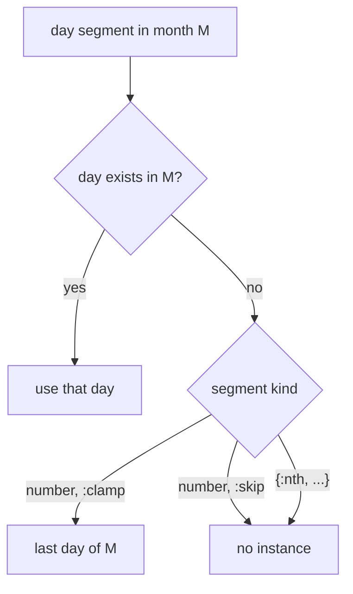

[AI SLOP]{.ai-slop} an AI agent wrote this page. [yuri4n](https://github.com/yuri4n), a senior engineer, gave the direction and did the review. The review is human, thus errors can stay.

## Status

Accepted, 2026-08-04, decided by the project owner.

## Context

Some day numbers do not exist in some months. "The 31st" names nothing in February. "The 30th of every month" must still mean something, because users write such recurrences often.

The forces:

- A recurrence is written once and runs forever. A rule that fails later harms the user at the worst moment.
- Users who write "the 31st" often mean "the end of the month". Users who write "Feb 29" often mean the literal date.
- One symbol cannot serve both intents. The library must pick a default and give an override.

## Options

### Option 1: error at ground time

`Span.ground/3` raises when an instance does not exist. Caveat: this makes valid recurrences unusable. "The 31st of every month" is a reasonable rule, and it would crash eleven months after it worked in January. Failure is not acceptable as a default meaning.

### Option 2: always skip the missing instance

February simply has no 31st. This is honest, but it surprises users who expect month-end behavior. Their monthly bill silently disappears in February. Silent data loss is worse than an adjusted date.

### Option 3 (chosen): clamp by default, skip per point

Clamp moves the overflow day to the month end: the 31st becomes Feb 28 (Feb 29 in a leap year). A per-point `overflow: :skip` field overrides this for literal dates. This is the strategy pattern: the point carries a small policy value, and one denotation function reads it.

## Decision

Option 3 is the chosen one. The precise rules:

- Every `Zocam.Point` has an `overflow` field: `:clamp` (the default) or `:skip`. `Point.new!/1` validates it.
- Under `:clamp`, a day number that a short month cannot hold moves to the last day of that month.
- Under `:skip`, the instance does not exist in that month. "Feb 29" with `:skip` fires only in leap years.
- `{:day, -1}` means the last day of the month. Negative indices count from the end. This is the honest spelling of "month end", distinct from `day(31)` plus clamping.
- An `{:nth, n, weekday}` selector that finds no match always skips. A four-Wednesday month has no 5th Wednesday, and it never falls back to the 4th. This follows RFC 5545 (iCalendar). The rule stays deliberately, for least surprise. The rule splits by kind: a day number *measures* into the month, so it clamps. An ordinal *selects* from what exists, so it skips.
- `Point.compose/2` keeps the overflow policy of the operand whose chain holds the day segment, because the policy only acts there.
- The clamp lives in one shared denotation function, used by both `Span.member?/2` and `Span.ground/3` (see [ADR-005](/design/adrs/005-shared-denotation)). Otherwise "the 31st" would disagree between the two in February.

_Figure 1 — How a day segment resolves in a month that is too short: clamp, skip, or ordinal skip. AI generated, human reviewed._

## Consequences

Easy now:

- Common recurrences work with no extra options. "The 31st, monthly" fires twelve times a year.
- Literal dates stay expressible: one option flips the meaning per point.
- `member?/2` and `ground/3` cannot drift, because both call the same denotation function. The tests in `test/zocam/span_test.exs` pin this.

Hard now:

- `day(31)` under `:clamp` and `day(-1)` denote the same set. Two spellings for one meaning is a cost. Both spellings stay, because they state different intents.
- The `overflow` field is present on every point but acts only on day numbers. Elsewhere it is inert.

Open items: none. The rules are implemented, and the tests in `test/zocam/span_test.exs` pin them.

> Clamping applies only to day numbers in months. Weeks, weekdays, and times cannot overflow, because their vocabularies are fixed.
