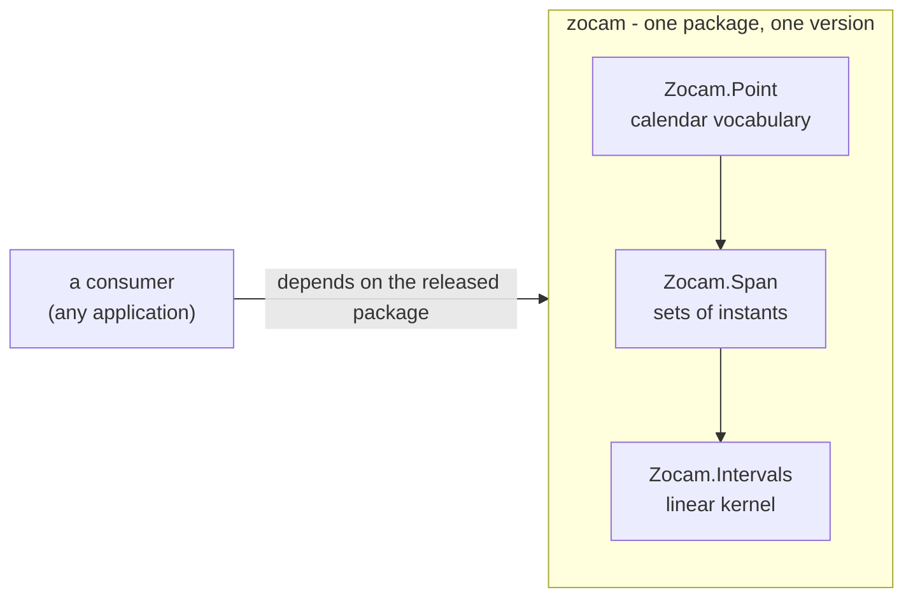

[AI SLOP]{.ai-slop} an AI agent wrote this page. [yuri4n](https://github.com/yuri4n), a senior engineer, gave the direction and did the review. The review is human, thus errors can stay.

## Status

Accepted, 2026-08-04, decided by the project owner ("separate it as a library"). The name, the project shape, and the module split are implementation choices by Claude, reviewed with the rest of that change.

Revised 2026-08-05. The chosen option is now a separate repository plus a release on Hex. The consumer's half of the original record moved out of this series.

## Context

The time layer became complete and self-contained. `Intervals` (the linear kernel), `Point` (calendar things), and `Span` (sets of instants) are fully implemented and tested. Nothing in the three layers knows about activities, goals, or solvers. Code with that profile is a library.

The code grew inside the s7r application, in one directory of that repository. That is history, and it explains the name of the original record ("library extraction"). It is not a property of the code.

This record covers the library's side only. The consumer's side of this decision is recorded in s7r's own ADR-001.

## Options

The options below are the list as it stood on 2026-08-04. Keep them as history. The outcome went further than Option 3, which was the option marked "chosen" at that date. Option 4 records what actually happened.

### Option 1: keep one mix project

No structural change. Caveat: the boundary stays informal. Application code can reach into kernel internals, and the time layer cannot be reused or versioned alone.

### Option 2: an umbrella project

Restructure the repository into two applications under one umbrella. Caveat: umbrellas force shared configuration and a heavier layout onto a project with exactly two parts, one of which is a draft.

### Option 3: a nested mix project, consumed by path (chosen on 2026-08-04, superseded)

A standalone mix project in a subdirectory, consumed by the application as a path dependency. The boundary is a real OTP application with its own tests and docs, but the code stays in one repository and one review flow.

Caveat, and the reason this option did not hold: a nested project cannot be versioned or released by itself. There is no artifact, no checksum, and no published reference page. The consumer's tools also keep reaching across the boundary with `../` paths, because the two projects share a working tree.

### Option 4: its own git repository, published to Hex (chosen on 2026-08-05)

The library becomes a repository of its own and ships as a Hex package. The boundary is then a version number, not a directory name.

Caveat: two repositories cost more machinery. Each one needs its own CI, its own release path, and its own documentation. A change that a consumer needs cannot arrive before a publish.

## Decision

- The library is **zocam**: the modules `Zocam.Intervals`, `Zocam.Point`, and `Zocam.Span`, plus the `Zocam` overview module.
- **zocam is its own repository**, at `github.com/yuri4n/zocam`. It holds one version attribute (`@version "0.1.0"` in `mix.exs`), its own Hex package metadata, its own CI workflow, and its own release workflow. A git tag `vX.Y.Z` that equals that attribute publishes the package to Hex.pm and the reference pages to hexdocs.pm. The workflow stops when the tag and the attribute differ. The site is at [zocam.dev](https://zocam.dev). Version 0.1.0 is published, so a consumer declares `{:zocam, "~> 0.1"}` and gets a checksummed artifact.
- **`Intervals` moves with the tower.** `Span.ground/3` produces kernel intervals, and `Arc` reuses the kernel's closing type. A split would force a shared third package or duplicate types. One package therefore carries all three layers.
- **The kernel became calendar-free.** `Intervals.timables/0` narrowed to `Time.t() | DateTime.t()`. Weekday and month atoms could never be ordered by the comparison helpers, so they were data that no operation could touch. The calendar vocabulary now lives in `Zocam.Point`, and `Zocam.Span.ground/3` is the bridge from "a Saturday" to concrete intervals.
- **The decision records are website content.** They live in `docs/content/2.design/adrs/`. A person writes them, and they are committed. No script generates them. ExDoc publishes the API reference only, because the frontmatter and the MDC syntax of these pages render as garbage on hexdocs.

_Figure 1 — The three layers of the library and the one direction a consumer may point. AI generated, human reviewed._

## Consequences

- The library versions and evolves alone. A release is a decision inside this repository, and no consumer can block it.
- The library cannot see a consumer. Its records, its examples, and its tests must therefore stand alone. A test that needs an application to make sense does not belong here.
- One test suite, one CI workflow, and one documentation site, all owned here. That machinery is the price of the separation.
- The repository must keep its own README, its own guide, and its own ADR series numbered from 001. Nothing is inherited from another project.
- A change that a consumer needs now costs a publish and a version bump. This record does not decide how a consumer works around that wait; that is the consumer's decision.
- `zocam` runs no processes and holds no state. A consumer that wants caching, for example memoized grounding, builds its own process layer on top of these pure functions.
