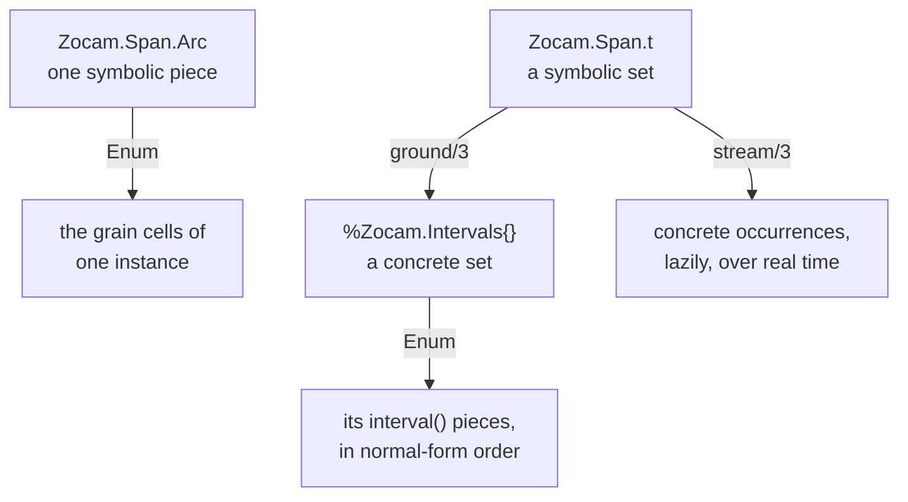

[AI SLOP]{.ai-slop} an AI agent wrote this page. [yuri4n](https://github.com/yuri4n), a senior engineer, gave the direction and did the review. The review is human, thus errors can stay.

## Status

Accepted, 2026-08-05, decided by the project owner. The accepted option was refuted once, earlier the same day. This record names the refutation and what removed it (see Options).

## Context

The kernel `Zocam.Intervals` accepts three spellings of "some intervals": one bare map (a piece), a plain list of maps, and the `%Zocam.Intervals{}` struct. Before this decision, the set operations also *answered* in three shapes. The documented rule said: "the answer follows the shape of the first argument". `diff(piece, piece)` answered with a piece or `nil`. `diff(list, list)` answered with a list. Only the struct got the struct back.

An audit of the kernel (the decision issue YUR-55 on the project board) found three problems with that rule.

- **The rule was false.** The dispatch looked at both arguments, not at the first one. `diff(piece, list)` answered with a list. The sentence in the docs and the code disagreed.
- **The kernel did not follow its own rule.** `union/2` took lists only and crashed on a piece or on the struct. `overlaps?/2` answered with a boolean at every level. The rule had exceptions from the start.
- **The dispatch made a defect possible.** A map with `from` and `until` but no closings passed the entry check (two keys) and failed the piece guard (four keys). The operation clauses passed it around in a circle, and the call never returned. This was the infinite loop of YUR-79. The multi-level dispatch was the ground it stood on.

The three answer shapes also spelled "nothing remains" three ways: `nil` at the piece level, `[]` at the list level, `%Zocam.Intervals{intervals: []}` at the struct level. Every caller had to know which empty value to expect.

One more force: [ADR-002](/design/adrs/002-set-primary-spans) already made sets primary in the symbolic layer, for closure — an operation on a set can answer with more pieces than it received, so only a set type survives its own operators. The concrete kernel had the same closure need, but not the same answer.

## Options

**Option A: keep the shape-following dispatch and repair it.** Fix the false sentence, and make the entry funnel raise on a partial map. Caveat: the three spellings of "empty" stay, every caller keeps a three-way case, and the piece-level dispatch — the ground the loop stood on — stays in the code.

**Option B: always answer with the struct.** One return shape for every set operation. This option was proposed in the audit and **refuted** there: the struct did not implement `Enumerable` at that time. The list answer was the only shape that `Enum` and comprehensions could walk, and the library itself used it that way — the evaluator inside `Zocam.Span.ground/3` fed set-operation results to comprehension generators. Six call sites and one spec would break, and every walk over a result would first reach inside the struct for `.intervals`. Note what the refutation named: a missing capability of the struct, not a flaw in the idea.

**Option C: Option B plus `Enumerable`.** Give the struct the capability whose absence refuted Option B. When `%Zocam.Intervals{}` enumerates its own pieces, a comprehension generator takes the struct directly, and the cost that killed Option B is gone. The same move applies to the other value that holds pieces: `Zocam.Span.Arc`, whose one instance is a row of grain cells.

## Decision

Option C is the chosen one. Two rules carry it, and one idea carries both: **a set is one value.**

**Rule one: an operation on sets answers with a set; a constructor of a piece answers with a piece.** `union/2`, `intersect/2`, `diff/2`, `complement/1`, and `compress/1` accept every spelling — a piece, a list of pieces, or the struct — and always answer with `%Zocam.Intervals{}`. One entry funnel normalizes every operand; a shape it cannot take raises an `ArgumentError` that names the rejected shape, so the partial-map loop of YUR-79 cannot start. `new!/1` still builds one interval map, and `overlaps?/2` still answers a boolean — neither is an operation on sets.

**Rule two: a value that holds pieces can be walked.** Both piece-holding values implement `Enumerable`, and each yields what it honestly holds:

- `%Zocam.Intervals{}` yields its concrete `interval()` pieces, in normal-form order. Walk a grounded span and read fields off real windows.
- `Zocam.Span.Arc` yields the symbolic cells of **one instance**: `Fri..Mon` yields four weekday cells, `Nov..Feb` walks through the cycle seam, an `:open` side drops that bound's cell, and a step on the grain unit samples every n-th cell. When one instance has no fixed cell row — a continuous `:time` arc without a step, or a step that samples across instances ("the 31st, monthly") — `Enum` raises an error that names the ways out: give the arc a step, or ground the span with `Zocam.Span.ground/3`.

_Figure 1 — What a walk yields on each shape: concrete pieces from a set, symbolic cells from an arc, occurrences from a streamed span. AI generated, human reviewed._

The precise rules:

- **The empty set is one value.** "Nothing remains" is always `%Zocam.Intervals{intervals: []}` — never `nil`, never `[]`. The bare literal `%Zocam.Intervals{}` is that same value, because the struct's list now defaults to `[]`.
- **The arc walk reuses `ground/3`'s reading of "cell".** The same wrap rule, the same whole-unit closings, the same step sampling. One meaning of "cell", two interpreters — the same single-source rule that [ADR-005](/design/adrs/005-shared-denotation) set for `member?/2` and `ground/3`.
- **`Enum.member?/2` is piece membership, not coverage.** It asks "is this value one of the pieces?", not "is this instant inside the set?". An instant inside a piece is still not a piece. For coverage, keep the span and ask `Zocam.Span.member?/2`.

## Consequences

Easy now: composition. A set-operation result feeds the next operation, a comprehension, or `Enum`, with no shape check between. Callers stopped handling nil-or-list-or-struct, and the false "first argument" sentence is gone from every page.

This is a breaking change to the kernel's answers. The project has no users, so there is no deprecation path — the call sites, the tests, and the docs moved in the same change.

Hard now: the piece-level answers are gone. A caller that wants the bare list reaches for the `intervals` field. And `Enum.member?/2` looks like a coverage test to a newcomer but is not one; the pitfall is documented with a doctest in the `Zocam.Intervals` moduledoc.

Open items: none in the code — the rules above are implemented and the tests pin them. The doctests in the `Zocam.Intervals` and `Zocam.Span.Arc` docs run in the test suite, so each example on this page's linked references stays true.

> See [the `Zocam.Intervals` module reference](/api/zocam-intervals) and [the `Zocam.Span.Arc` reference](/api/zocam-span-arc) for the full rules with runnable examples.
