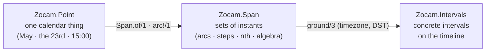

---
seo:
  title: "Zocam — composable time for Elixir"
  description: "A time library for Elixir: calendar points, span algebra over sets of instants, and an interval kernel. Grounded in a timezone, correct across DST."
---

::u-page-hero
#title
ZOCAM[_]{.cursor}

#description
Composable time for Elixir. `Point` names a calendar thing, `Span` builds sets of instants over points, and `ground/3` maps a set to concrete intervals in a timezone — DST included.

*Zocam* is the Muisca year: a cycle of twenty moons, recorded in colonial Bogotá and later studied by Humboldt. A library about calendars carries a calendar word.

#links
  :::u-button
  ---
  color: neutral
  size: xl
  to: /guide/introduction
  trailing-icon: i-lucide-arrow-right
  ---
  Get started
  :::

  :::u-button
  ---
  color: neutral
  size: xl
  to: /api
  variant: outline
  ---
  API reference
  :::
::

::div{.board-note}
[AI SLOP]{.ai-slop} An AI agent wrote this page. [yuri4n](https://github.com/yuri4n), a senior engineer, gave the direction and did the review. The review is human, thus errors can stay.
::

## The two layers

| Layer | Module | What it holds |
| --- | --- | --- |
| Calendar | [`Zocam.Point`](/api/zocam-point) | One calendar thing: "May", "the 23rd", "15:00" |
| Calendar | [`Zocam.Span`](/api/zocam-span) | Sets of instants: arcs, steps, ordinals, set algebra |
| Timeline | [`Zocam.Intervals`](/api/zocam-intervals) | Concrete intervals: union, intersection, complement, diff |

*Figure 1 — The two layers of the library and the module that owns each. AI generated, human reviewed.*

*Figure 2 — The two layers and the one crossing point: a span meets the real timeline only in `ground/3`. AI generated, human reviewed.*

::u-page-section
#title
One denotation, two questions

#features
  :::u-page-feature
  ---
  icon: i-lucide-milestone
  to: /api/zocam-point
  ---
  #title
  Points: calendar values

  #description
  `Zocam.Point` models one calendar thing as a scope plus a refinement chain — concrete ("May 2026") or abstract ("May"). The shape of a point is a design decision on its own: see ADR-001.
  :::

  :::u-page-feature
  ---
  icon: i-lucide-route
  to: /api/zocam-span
  ---
  #title
  Spans: sets of instants

  #description
  `Zocam.Span` is a recursive set algebra over points and arcs: unions, intersections, complements, steps, and ordinal picks such as "last working day of the month". Sets come first; single moments are the special case.
  :::

  :::u-page-feature
  ---
  icon: i-lucide-train-track
  to: /api/zocam-intervals
  ---
  #title
  The interval kernel

  #description
  `Zocam.Intervals` is the linear kernel: sets of concrete intervals with union, intersection, complement, and difference. `Span.member?/2` and `Span.ground/3` share ONE denotation function, so the two answers can never disagree — even across a DST jump.
  :::
::
